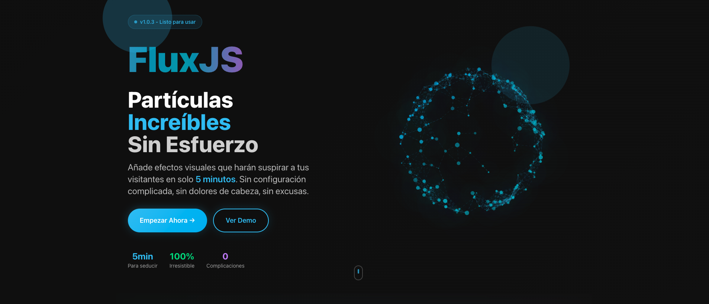
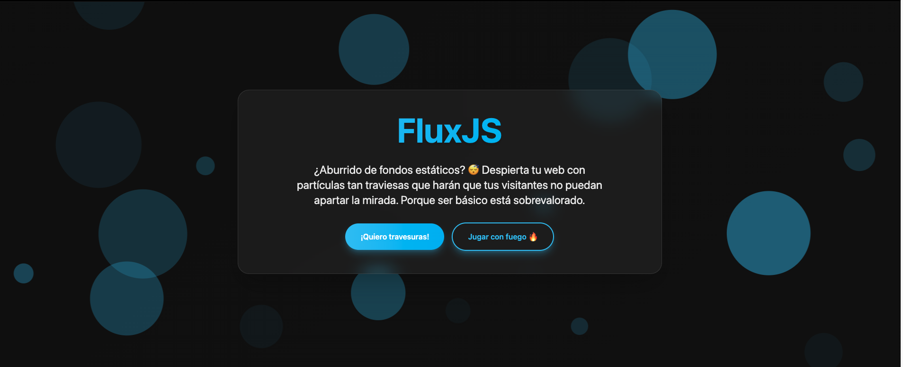

<p align="center">
  
</p>

# FluxJS ✨

La librería de partículas más sed### 🎮 Sistema de Eventos Completo (Callbacks más responsivos que tu mejor amigo)

- **onInit**: Cuando FluxJS cobra vida (más emocionante que desempacar un regalo)
- **onStart/onStop**: Control total del ciclo de vida (tú tienes el poder)
- **onResize**: Responsive que realmente responde (adaptabilidad instantánea)
- **onParticleClick**: Click individual en partículas (cada una tiene su personalidad)
- **onParticleHover**: Hover con efectos dinámicos (interacción que seduce)
- **onViewportEnter/Exit**: Eventos de visibilidad más precisos que tu GPS
- **onClick del mouse**: Callbacks personalizados para interacción máximal internet. Sí, has leído bien: **seduce** a tus visitantes con efectos visuales que los harán suspirar "¿cómo diablos hiciste esto?". Más adictiva que el scroll infinito y más irresistible que los memes de gatos. Con más de 100 opciones de personalización porque, seamos honestos, te gusta tener todo bajo control... 😏

## 🚀 Características Principales

### 🧠 Características Innovadoras (Porque lo mediocre no está en nuestro vocabulario)

- **🔋 Optimización Inteligente de Batería**: Más consciente que tu mejor amigo cuando se trata de no agotarte: detecta automáticamente el nivel de batería y ajusta el rendimiento para mantenerte funcionando toda la noche 😉
- **👁️ Lazy Loading con Viewport**: Solo se activa cuando alguien está mirando (como tú en una fiesta): inicia las animaciones únicamente cuando el elemento es visible en pantalla
- **🎭 Multi-Touch Avanzado**: Soporte completo para múltiples toques porque sabemos que tus usuarios tienen manos ágiles y no van a contenerse
- **🧠 IA de Rendimiento**: Sistema tan adaptativo que hace que Siri parezca tímida: ajusta automáticamente la calidad según el dispositivo (incluso funciona en esa reliquia tecnológica que aún guardas)
- **♿ Accesibilidad Nativa**: Más respetuoso que un canadiense: honra las preferencias del sistema como `prefers-reduced-motion` porque la elegancia también es cuestión de buenos modales
- **🔧 Auto-Diagnóstico**: Sistema tan inteligente que detecta y soluciona problemas antes de que te des cuenta (ojalá las relaciones funcionaran así)

### 🎨 Sistema de Colores Avanzado (Más variado que los gustos de Tinder)

- **Colores simples**: Para cuando quieres algo clásico pero con clase
- **Gradientes**: Porque la vida en monocromo es cosa del pasado
- **Arcoíris animado**: Para cuando tu lado más juguetón toma las riendas del diseño
- **Paletas aleatorias**: Déjalo al destino (pero con buen gusto garantizado)

<p align="center">
  
</p>

### ⚡ Física Realista (Más precisa que tu GPS cuando necesitas llegar puntual)

- **Gravedad**: Configurable en 4 direcciones porque Newton aprobaría este nivel de rebeldía
- **Viento**: Fuerza y dirección personalizables (efectos atmosféricos sin la factura de electricidad)
- **Fricción**: Simulación de resistencia del aire más realista que tus expectativas de lunes por la mañana
- **Rebotes**: Factor de rebote configurable para cuando necesitas que las cosas regresen con más energía
- **Turbulencia**: Movimiento caótico tan realista que hace que el tráfico parezca predecible

### 🖱️ Interacción Avanzada con Mouse (Más receptivo que tu crush cuando le escribes)

- **Atracción/Repulsión**: Fuerzas configurables para crear esa tensión visual que todos necesitamos
- **Magnetismo**: Atracción instantánea (más efectiva que cualquier línea de ligue)
- **Trail del mouse**: Rastro visual con efectos de glow más brillante que tu sonrisa después del primer café
- **Eventos personalizados**: onClick, onHover callbacks porque la personalización es tu segunda naturaleza
- **Detección de partículas**: Click en partículas individuales (cada una merece su momento de gloria)
- **Sparkles**: Partículas brillantes que siguen al cursor como si fueras una celebridad
- **Multi-touch avanzado**: Soporte completo para pantallas táctiles (porque tus dedos merecen respeto)
- **Configuración táctil**: Distancias y fuerzas optimizadas para móviles (el tamaño importa, pero la precisión más)
- **Cache de distancias**: Optimización de cálculos que haría llorar de felicidad a cualquier matemático
- **Trail con glow**: Efectos visuales tan seductores que hipnotizan
- **Configuración independiente táctil**: Diferentes configuraciones para touch vs mouse (porque no todos los dedos son iguales)

### ✨ Efectos Especiales (Hollywood llamó, quieren contratar nuestros efectos)

- **Glow**: Efecto de brillo configurable más radiante que tu ego después de un código perfecto
- **Sombras**: Sombras con desplazamiento y desenfoque para ese drama visual que necesitas
- **Twinkle**: Efecto de centelleo porque todo merece su momento de estrella
- **Pulse**: Pulsación de tamaño más hipnótica que el latido de tu corazón en una cita
- **Flicker**: Parpadeo de opacidad más sutil que un guiño coqueto
- **FadeIn**: Aparición gradual más suave que la transición de soltero a comprometido

### 🔵 Formas Personalizadas (Más variedad que las excusas para no hacer ejercicio)

- **Círculos**: La forma clásica que nunca decepciona
- **Cuadrados**: Para los que prefieren las cosas claras y definidas
- **Triángulos**: Geometría básica pero con personalidad
- **Estrellas**: Configurables con cualquier número de puntas (porque la perfección tiene muchas formas)
- **Corazones**: Para cuando tu web necesita más amor del que está recibiendo
- **Polígonos**: Lados configurables porque ¿por qué conformarse con lo convencional?
- **Formas custom**: Función de dibujo personalizada para los artistas más rebeldes
- **Rotación continua**: Porque todo se ve mejor en movimiento
- **Distribución de tamaño**: Uniforme, gaussiana o exponencial (matemáticamente seductora)

### 🌊 Animaciones Avanzadas (Más fluidas que tus movimientos de baile después de dos copas)

- **Float**: Movimiento libre como tu espíritu en fin de semana
- **Bounce**: Rebotes en bordes más energéticos que tú con tu playlist favorita
- **Spiral**: Movimiento espiral tan hipnótico que te hace olvidar la hora
- **Wave**: Ondas sinusoidales más relajantes que un masaje
- **Orbit**: Órbitas circulares más precisas que tus planes de vida
- **Direcciones**: Up, down, left, right, random (como tus decisiones amorosas)

### 🕸️ Sistema de Conexiones Mejorado

- **Conexiones animadas**: Líneas punteadas en movimiento
- **Conexiones curvas**: Líneas no rectas
- **Límite de conexiones**: Máximo por partícula
- **Colores independientes**: Color separado de partículas
- **Grosor configurable**: Ancho de líneas

### 📱 Sistema Responsive Inteligente

- **Breakpoints personalizables**: Mobile, tablet, desktop
- **Ajuste automático**: Número de partículas según pantalla
- **Escalado del contenedor**: Adaptación a contenedores
- **Detección de dispositivo**: Identifica automáticamente el tipo de dispositivo
- **Configuración por dispositivo**: Diferentes ajustes para móvil, tablet y escritorio
- **Simplificación automática**: Desactiva efectos pesados en dispositivos móviles

### ⚙️ Optimización y Rendimiento Inteligente (Porque la velocidad es seductora)

- **Control de FPS**: Límite de cuadros por segundo configurable (para que no se maree ni tu abuela)
- **Pausa automática**: Al perder foco de ventana (ahorra batería y tu dignidad)
- **Calidad adaptativa**: Ajuste automático de calidad según el rendimiento (más inteligente que tu autocorrector)
- **Optimización de conexiones**: Algoritmos espaciales (Spatial Grid) para detección tan eficiente que da envidia
- **🔋 Detección de batería**: Monitorea el nivel de batería y reduce automáticamente partículas cuando < 20% (más cuidadoso que tu mamá)
- **Object Pooling**: Reutilización de objetos para el trail del mouse (cero desperdicios, máximo glamour)
- **Cache inteligente**: Sistema de cache para colores, distancias y gradientes (memoria fotográfica digital)
- **WebGL automático**: Detección y uso automático de aceleración GPU cuando está disponible (aprovecha cada pixel)
- **Hardware acceleration**: Transform3D y backface-visibility para móviles (velocidad que impresiona)
- **Culling**: Solo renderiza partículas visibles en pantalla (eficiencia nivel ninja)

### 📱 Características Móviles Avanzadas (Porque tu dispositivo del 2020 también merece cariño)

- **Detección inteligente de dispositivos**: Detecta automáticamente móviles, tablets y escritorio (más certero que tu intuición)
- **Multi-touch**: Soporte para múltiples toques simultáneos (hasta 10 dedos trabajando en armonía)
- **Optimización táctil**: Distancias y fuerzas ajustadas para pantallas táctiles (cada toque cuenta)
- **Hardware acceleration**: Uso de transform3D y backface-visibility para rendimiento que impresiona
- **Gestión de memoria**: Límites automáticos de partículas en dispositivos móviles (cuidamos tu RAM como oro)
- **Preferencias de accesibilidad**: Respeta `prefers-reduced-motion` del sistema (elegancia inclusiva)
- **Optimización de batería**: Monitoreo automático y ajuste de rendimiento (tu batería nos lo agradecerá)
- **Responsive automático**: Ajuste de partículas según breakpoints configurables (adaptabilidad nivel camaleón)

### 👁️ Lazy Loading y Viewport (Solo trabaja cuando vale la pena)

- **Intersection Observer**: Inicia las animaciones solo cuando el elemento es visible (eficiencia que enamora)
- **Viewport threshold**: Configurable porcentaje de visibilidad para activar (por defecto 10%, pero tú decides)
- **Root margin**: Configuración de margen para empezar antes de ser visible (por defecto 50px de anticipación)
- **Lazy loading inteligente**: Ahorro de recursos en elementos fuera de pantalla (minimalismo digital)
- **Eventos de viewport**: Callbacks `onViewportEnter` y `onViewportExit` (control total de la experiencia)
- **Observación flexible**: Opción de observar solo una vez o continuamente (tu eliges el nivel de atención)
- **Auto-limpieza**: Sistema que destruye demos cuando salen del viewport (limpieza automática nivel Marie Kondo)

### 🎛️ Sistema de Eventos Avanzado

- **Callbacks completos**: onInit, onStart, onStop, onResize, onParticleClick, onParticleHover
- **Eventos de viewport**: onViewportEnter, onViewportExit
- **Diagnóstico automático**: Sistema de diagnóstico para detectar problemas
- **Manejo de errores**: Recuperación automática de errores de inicialización

### 🎮 Sistema de Eventos Completo (Callbacks para todo)

- **onInit**: Cuando FluxJS cobra vida (como Pinocho pero mejor)
- **onStart/onStop**: Control total del ciclo de vida
- **onResize**: Responsive que realmente responde
- **onParticleClick**: Click individual en partículas (cada una es especial)
- **onParticleHover**: Hover con efectos dinámicos
- **onViewportEnter/Exit**: Eventos de visibilidad inteligentes
- **onClick del mouse**: Callbacks personalizados para interacción

## 📦 Instalación

### CDN (Recomendado)

```html
<script src="https://unpkg.com/@pablotheblink/fluxjs@1.0.3/flux.js"></script>
```

### Descarga Directa

```html
<script src="flux.js"></script>
```

### NPM

```bash
npm install @pablotheblink/fluxjs
```

```javascript
// CommonJS
const { createFlux } = require("@pablotheblink/fluxjs");

// ES6 Modules / TypeScript
import { createFlux } from "@pablotheblink/fluxjs";
```

## 🎯 Uso Rápido

### Inicialización Básica

```javascript
// Fondo simple
const flux = new FluxJS();

// Con configuración básica
const flux = new FluxJS({
  container: document.getElementById("mi-contenedor"),
  count: 100,
  color: { type: "rainbow" },
});
```

### Usando Presets

```javascript
// Estrellas brillantes
const stars = createFlux.stars(document.body, {
  count: 200,
  effects: { twinkle: true, glow: true },
});

// Red neural interactiva
const network = createFlux.network(document.body, {
  mouse: { magnetism: true },
  connections: { animated: true },
});

// Burbujas con física
const bubbles = createFlux.bubbles(document.body, {
  physics: { gravity: 0.1, wind: 0.05 },
});

// Galaxia en órbita
const galaxy = createFlux.galaxy(document.body, {
  count: 300,
  animation: { orbit: { radius: 250 } },
});
```

## 🎨 Ejemplos de Configuración

### Colores Avanzados

```javascript
const flux = new FluxJS({
  color: {
    type: "gradient",
    gradient: ["#FF6B6B", "#4ECDC4", "#45B7D1", "#96CEB4"],
  },
});

// Arcoíris dinámico
const rainbow = new FluxJS({
  color: {
    type: "rainbow",
    rainbowSpeed: 0.03,
  },
});

// Paleta personalizada
const custom = new FluxJS({
  color: {
    type: "random",
    randomPalette: ["#FF0000", "#00FF00", "#0000FF", "#FFFF00"],
  },
});
```

### Física Completa

```javascript
const physics = new FluxJS({
  physics: {
    gravity: 0.15,
    gravityDirection: "down",
    friction: 0.02,
    bounce: 0.8,
    wind: 0.05,
    windDirection: Math.PI / 4,
  },
  animation: { type: "bounce" },
});
```

### Efectos Especiales

```javascript
const magical = new FluxJS({
  effects: {
    glow: true,
    glowColor: "#FFD700",
    glowSize: 20,
    twinkle: true,
    shadow: true,
  },
  size: {
    pulse: true,
    pulseIntensity: 0.8,
  },
  opacity: {
    flicker: true,
    fadeIn: true,
  },
});
```

### Formas Personalizadas

```javascript
const hearts = new FluxJS({
  shape: {
    type: "heart",
    rotation: true,
    rotationSpeed: 0.02,
  },
  color: { type: "gradient", gradient: ["#FF69B4", "#DC143C"] },
});

// Forma completamente personalizada
const custom = new FluxJS({
  shape: {
    type: "custom",
    customPath: (ctx, particle) => {
      ctx.beginPath();
      ctx.arc(particle.x, particle.y, particle.size, 0, Math.PI * 2);
      ctx.moveTo(particle.x + particle.size, particle.y);
      ctx.arc(particle.x, particle.y, particle.size * 0.5, 0, Math.PI * 2);
      ctx.fill();
    },
  },
});
```

### Interacción Avanzada

```javascript
const interactive = new FluxJS({
  mouse: {
    interact: true,
    distance: 200,
    attraction: 0.1,
    magnetism: true,
    trail: true,
    trailLength: 20,
    onClick: (event, flux) => {
      // Crear explosión en el punto de click
      flux.explode(event.clientX, event.clientY, 10, 200);
    },
  },
  events: {
    onParticleClick: (particle, flux) => {
      // Cambiar color de partícula clickeada
      particle.size *= 2;
      setTimeout(() => (particle.size /= 2), 1000);
    },
  },
});
```

## 🛠️ API Completa

### Métodos de Control

```javascript
flux.start(); // Iniciar animación
flux.stop(); // Detener animación
flux.destroy(); // Limpiar completamente

// Configuración dinámica
flux.updateConfig({ count: 200 });
flux.setColor("#ff0000");
flux.setAnimation("spiral");
flux.setPhysics({ gravity: 0.1 });
```

### Métodos de Interacción

```javascript
// Añadir partícula personalizada
flux.addParticle(x, y, {
  size: 10,
  color: "#ff0000",
  vx: 2,
  vy: -1,
});

// Efectos dinámicos
flux.explode(x, y, force, radius); // Explosión
flux.attract(x, y, force, radius); // Atracción
flux.removeParticle(index); // Eliminar partícula

// Utilidades
const particle = flux.getParticleAt(x, y);
```

### Eventos Disponibles

```javascript
const flux = new FluxJS({
  events: {
    onInit: (flux) => console.log("Inicializado"),
    onStart: (flux) => console.log("Iniciado"),
    onStop: (flux) => console.log("Detenido"),
    onResize: (flux) => console.log("Redimensionado"),
    onParticleClick: (particle, flux) => console.log("Partícula clickeada"),
    onParticleHover: (particle, flux) => console.log("Mouse sobre partícula"),
  },
});
```

## 🎮 Presets Incluidos

- **stars**: Campo de estrellas con efecto twinkle
- **network**: Red neural animada estilo Matrix
- **bubbles**: Burbujas con física realista
- **spiral**: Movimiento en espiral hipnótico
- **galaxy**: Simulación de galaxia en órbita
- **matrix**: Efecto Matrix con caída verde
- **hearts**: Corazones flotantes románticos
- **aurora**: Efectos de aurora boreal
- **cosmic**: Espacio profundo con gradientes morados

## 📱 Responsive por Defecto

```javascript
const flux = new FluxJS({
  responsive: {
    enabled: true,
    breakpoints: {
      mobile: { width: 768, particles: 0.3 },
      tablet: { width: 1024, particles: 0.6 },
      desktop: { width: 1920, particles: 1.0 },
    },
  },
});
```

## 💡 Tips de Rendimiento (Para que tu web vuele más alto que tus expectativas)

1. **Usa menos partículas en móviles**: El sistema responsive ya lo hace automáticamente (somos así de considerados)
2. **Limita las conexiones**: Usa `maxConnections` para optimizar (menos conexiones, más seducción)
3. **Controla el FPS**: Usa `performance.maxFPS` para dispositivos que necesitan un respiro
4. **Pausa en blur**: `performance.pauseOnBlur` ahorra batería (y la cordura de tus usuarios)
5. **Usa Spatial Grid**: `optimizeConnections: true` para manejar miles de partículas como un profesional
6. **WebGL automático**: Deja que FluxJS detecte y use GPU cuando esté disponible (acelera tu corazón y tu web)
7. **Object Pooling**: El trail reutiliza objetos automáticamente (cero desperdicios, máximo estilo)
8. **Cache inteligente**: Los colores y distancias se cachean automáticamente (memoria que funciona mejor que la tuya)

## 🔧 Configuración Completa

Para ver todas las opciones disponibles, consulta [CONFIGURATION.md](CONFIGURATION.md) que incluye más de 100 opciones organizadas por categorías.

## 📖 Documentación Adicional

- [Guía de Configuración Completa](CONFIGURATION.md)
- [Demo Interactiva](demo.html)

## 🤝 Contribuciones

¡Las contribuciones son más bienvenidas que el Wi-Fi gratis en un café! FluxJS es un proyecto de código abierto que se alimenta de la creatividad y el talento de desarrolladores como tú (sí, estamos hablando contigo, genio).

### Formas de Contribuir (Todas son sexys, todas son valiosas)

- 🐛 **Reportar bugs**: Crea un issue describiendo el problema (mientras más detalles, más te amaremos)
- 💡 **Proponer features**: Sugiere nuevas funcionalidades (no tengas miedo de ser ambicioso)
- 📝 **Mejorar documentación**: Ayuda con ejemplos y guías (la documentación clara es pura seducción)
- 🔧 **Contribuir código**: Implementa fixes y nuevas características (tu código puede cambiar el mundo web)
- 🎨 **Crear ejemplos**: Desarrolla demos y casos de uso (la creatividad no conoce límites)
- 🧪 **Testing**: Ayuda con pruebas y validaciones (los bugs no tendrán escapatoria)

### Proceso de Contribución (Más sencillo que explicar por qué usas modo oscuro)

1. **Fork** del repositorio (como cuando copias la tarea, pero aquí está permitido)
2. **Clona** tu fork: `git clone https://github.com/tu-usuario/FluxJS.git`
3. **Crea una rama**: `git checkout -b feature/nueva-caracteristica`
4. **Implementa** tus cambios (aquí es donde brillas como la estrella que eres)
5. **Testea** tu código (porque nadie quiere bugs en producción, ¿verdad?)
6. **Commit**: `git commit -m "feat: descripción irresistible del cambio"`
7. **Push**: `git push origin feature/nueva-caracteristica`
8. **Crea un Pull Request** (y espera la magia colaborativa)

### Convenciones de Código (Porque el estilo es importante, incluso en el código)

- Usa **camelCase** para variables y funciones (como toda persona civilizada)
- Comenta código complejo (tu yo del futuro te adorará por esto)
- Mantén consistencia con el estilo existente (la armonía visual es irresistible)
- Incluye documentación para nuevos features (el conocimiento compartido es poder multiplicado)

Para más detalles, consulta [CONTRIBUTING.md](CONTRIBUTING.md).

## 🏆 Colaboradores

¡Gracias a todos los valientes desarrolladores que han contribuido a FluxJS! (Sin ustedes esto sería un monólogo muy solitario y considerablemente menos divertido)

<!-- Aquí se pueden agregar colaboradores automáticamente con tools como all-contributors -->

## 📄 Licencia

MIT License - ve [LICENSE](LICENSE) para más detalles.
